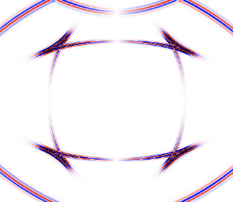

# ElasticFDSG.jl



[](https://wtegtow.github.io/ElasticFDSG.jl/stable/)
[](https://wtegtow.github.io/ElasticFDSG.jl/dev/)
[](https://github.com/wtegtow/ElasticFDSG.jl/actions/workflows/CI.yml?query=branch%3Amain)
[](https://doi.org/10.5281/zenodo.14872584)

ElasticFDSG.jl solves the elastic wave equation using finite differences on a staggered grid (FDSG) in the velocity-stress formulation [Virieux (1986)].


But why yet another implementation?
In many current applications, the installation of various dependencies, setting simulation setups, definition of model parameters or accesing the results are often already complicated tasks, especially for inexperienced users seeking a quick and straightforward workflow.
ElasticFDSG was developed with ease of use in mind. 
It aims to offer a user-friendly experience while also maintaining flexibility to be applied to a wide variety of simulation scenarios.
Users can easily customize their simulations by creating configuration files and defining velocity models in a straightforward manner, that can then be passed directly to the solvers.
Furthermore, ElasticFDSG is implemented primarily in base Julia, minimizing dependencies on external packages to ensure the package remains robust over time.


## Features 

- User friendly usage.
- 2D and 3D elastic forward modelling on regular grids.
- Multithreaded CPU and parallized GPU (Cuda & Metal) solver.
- Spatial derivatives of order 1 to 10.
- First order time stepping.
- Elastic isotropic or vertical transversal isotrop (VTI) 2D models using 2D Thomson parameter.
- Elastic isotropic, VTI or orthorhombic (ORT) 3D models using Tsvankin parameter.
- All elastic properties are defined on full integer grid points to simplify the creation of velocity models.
- Solver can handle fully heterogeneous media.
- Point and anisotropic double couple sources. 
- Absorbing boundaries using Convolutional-Perfectly-Matched-Layer.
- Save geophone receiver (velocity point sensors). 
- Save Distributed Acoustic Sensing (DAS) receiver, aligned with model coordinate axis (strain-profiles).
- Save snapshots at specified time steps.
- Easy-to-read source code.

A step by step user guide can be found in the [documentation](https://wtegtow.github.io/ElasticFDSG.jl/stable/).


## Installation

```julia-repl
using Pkg
Pkg.add(ElasticFDSG)
```

## Citing
If you find this package helpful for your research, please consider citing:

```
@misc{ElasticFDSG,
  author       = {William Tegtow},
  title        = {ElasticFDSG.jl: Simulating elastic wave propagation in 2D and 3D anisotropic media.},
  year         = {2025},
  publisher    = {GitHub},
  journal      = {GitHub repository},
  howpublished = {\url{https://github.com/wtegtow/ElasticFDSG.jl}},
  doi          = {https://doi.org/10.5281/zenodo.14872584}
}

```

**Note:**
This package is still in its early stages, and only limited testing has been done so far. Any bug report or suggestion is very welcomed.