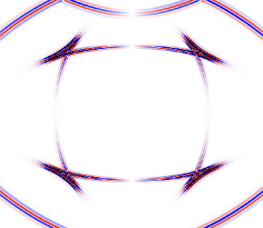

# ElasticFDSG.jl



[](https://wtegtow.github.io/ElasticFDSG.jl/dev/)
[](https://github.com/wtegtow/ElasticFDSG.jl/actions/workflows/CI.yml?query=branch%3Amain)
[](https://doi.org/10.5281/zenodo.14872584)

**ElasticFDSG.jl** is a Julia package for simulating elastic wave propagation in 2D and 3D heterogeneous anisotropic media.
It solves the elastic wave equation in the velocity–stress formulation using a finite-difference staggered-grid (FDSG) scheme.

## Features

- 2D and 3D elastic forward modelling on regular grids.
- Vendor-neutral CPU and GPU kernels (CUDA, Metal, AMDGPU, oneAPI) via [KernelAbstractions.jl](https://github.com/JuliaGPU/KernelAbstractions.jl).
- Spatial finite-difference operators of order 1-10.
- Second-order leapfrog time integration.
- Isotropic and VTI 2D models (Thomsen parameters ε, δ).
- Isotropic, VTI, and orthorhombic 3D models (Tsvankin parameters).
- Fully heterogeneous media with compressed stiffness-tensor storage.
- Convolutional Perfectly Matched Layer (C-PML) absorbing boundaries.
- Moment tensor sources.
- Geophone receivers (point particle velocity).
- DAS receivers (axial strain along coordinate-aligned profiles).
- Wavefield snapshots at arbitrary time steps.
- Results saved to HDF5 or returned as a Julia struct.

Full documentation: [https://wtegtow.github.io/ElasticFDSG.jl/dev/](https://wtegtow.github.io/ElasticFDSG.jl/dev/)

Working examples are in the [`examples/`](examples/) folder.

## Installation

```julia-repl
julia> using Pkg
julia> Pkg.add(url="https://github.com/wtegtow/ElasticFDSG.jl")
```

## Quick start

```julia
using ElasticFDSG

# --- 2D velocity model (7 × nx × nz) ---
nx, nz = 200, 200;  h = 10.0
xc = range(0.0, step=h, length=nx);  zc = range(0.0, step=h, length=nz)
X  = repeat(xc, 1, nz);  Z = repeat(reshape(zc,1,:), nx, 1)

velmod = zeros(7, nx, nz)
velmod[1,:,:] .= X;    velmod[2,:,:] .= Z
velmod[3,:,:] .= 3000; velmod[4,:,:] .= 1800;  velmod[5,:,:] .= 2500

# --- Configuration ---
config = config_template_2d(
    device="cpu", precision="Float32", fd_order=4, verbose=true,
    output_file="path_to_results.h5",
    t_start=0.0, t_end=0.5, dt=0.001,
    fdom=30.0, wavelet="ricker", wavelet_center=0.05,
    seismic_moment=1e9,
    src_x=1000.0, src_z=500.0,
    Mxx=0.0, Mxz=1.0, Mzz=0.0, anisotropic=false,
    xstart="absorbing",  xend="absorbing",
    zstart="reflecting", zend="absorbing",
    pml_layer=10,
    geophones=[Dict("x"=>1500.0,"z"=>500.0)],
    das_x_aligned=[], 
    das_z_aligned=[
      Dict(
            "x" => 50,
            "z" => Dict("start"=>100, "step"=>5, "end"=>900)
        ),
    ],
    snapshot_times=[0.25, 0.5], snapshot_fields=["vx","vz"],
)

ElasticFDSG.runsim(config, velmod)
```

## Citing

```bibtex
@misc{ElasticFDSG,
  author = {William Tegtow},
  title  = {ElasticFDSG.jl: Simulating elastic wave propagation in 2D and 3D anisotropic media.},
  year   = {2025},
  doi    = {https://doi.org/10.5281/zenodo.14872584}
}
```

> **Note:** This package is under active development. Bug reports and suggestions are very welcome.
