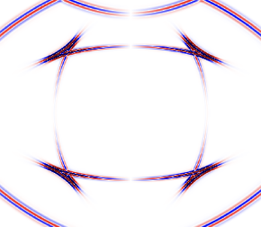
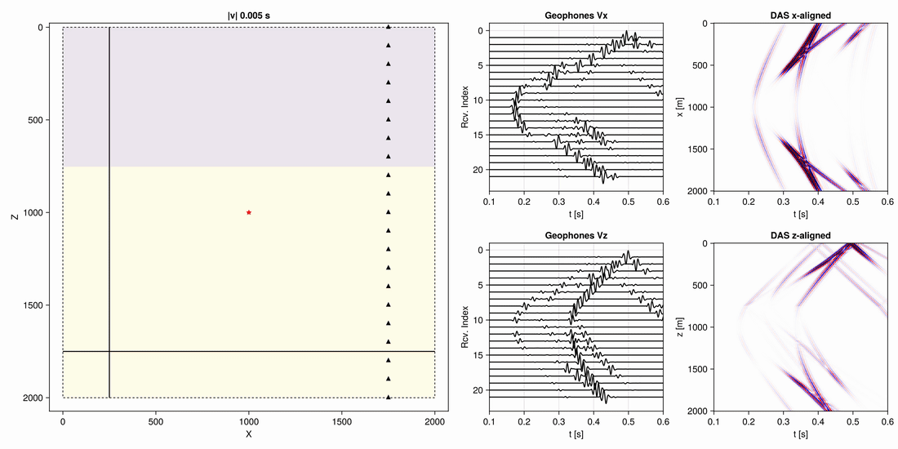

# ElasticFDSG.jl



[](https://wtegtow.github.io/ElasticFDSG.jl/dev/)
[](https://github.com/wtegtow/ElasticFDSG.jl/actions/workflows/CI.yml?query=branch%3Amain)
[](https://doi.org/10.5281/zenodo.14872584)

**ElasticFDSG.jl** is a Julia package for simulating elastic wave propagation in 2D and 3D heterogeneous anisotropic media.
It solves the elastic wave equation in the velocity–stress formulation using a finite-difference staggered-grid (FDSG) scheme.

## Features

- 2D and 3D elastic forward modelling on regular grids.
- Vendor-neutral CPU and GPU kernels (CUDA, Metal, AMDGPU, oneAPI) via [KernelAbstractions.jl](https://github.com/JuliaGPU/KernelAbstractions.jl).
- Spatial finite-difference operators of order 1-10.
- Second-order leapfrog time integration.
- Heterogeneous isotropic and VTI 2D models (Thomsen parameters).
- Heterogeneous isotropic, VTI, and orthorhombic 3D models (Tsvankin parameters).
- Convolutional Perfectly Matched Layer (C-PML) absorbing boundaries.
- Moment tensor sources.
- Geophone receivers (point particle velocity).
- DAS receivers (axial strain along coordinate-aligned profiles).
- Wavefield snapshots.
- Results saved to HDF5.

A step-by-step user guide can be found in the [documentation](https://wtegtow.github.io/ElasticFDSG.jl/dev/).

Working examples are in the [`examples/`](examples/) folder.

## Installation

```julia-repl
julia> using Pkg
julia> Pkg.add(url="https://github.com/wtegtow/ElasticFDSG.jl")
```

## Quick start

```julia
using ElasticFDSG

# domain
h = 5.0
x = 0:h:2000
z = 0:h:2000
nx = length(x); nz = length(z)

X = zeros(nx, nz)
Z = zeros(nx, nz)
@inbounds for i in 1:nx, j in 1:nz
    X[i, j] = x[i]
    Z[i, j] = z[j]
end

# velocity model (two layers, interface at z = 750 m)
vp  = fill(3500.0, nx, nz); vp[:, z .> 750]  .= 4500.0
vs  = fill(2200.0, nx, nz); vs[:, z .> 750]  .= 2600.0
rho = fill(2200.0, nx, nz); rho[:, z .> 750] .= 2600.0
eps = fill(0.4, nx, nz)
del = fill(-0.1, nx, nz)

# assemble velmod array (7 x nx x nz)
velmod = zeros(7, nx, nz)
velmod[1,:,:] .= X
velmod[2,:,:] .= Z
velmod[3,:,:] .= vp
velmod[4,:,:] .= vs
velmod[5,:,:] .= rho
velmod[6,:,:] .= eps
velmod[7,:,:] .= del

# config
config = Dict(
    "settings" => Dict(
        "device" => "cpu",
        "precision" => "Float64",
        "spatial_derivative_order" => 4,
        "verbose" => true,
        "output_file" => joinpath(@__DIR__, "demo.h5"),
    ),
    "time" => Dict(
        "start" => 0,
        "end" => 1,
        "timestep" => 0.001,
    ),
    "source" => Dict(
        "dominant_frequency" => 60.0,
        "wavelet_type" => "ricker",
        "wavelet_center" => 0.05,
        "seismic_moment" => 1e6,
        "location" => Dict(
            "x" => 1000.0,
            "z" => 1000.0,
        ),
        "moment_tensor" => Dict(
            "Mxx" => 1.0,
            "Mxz" => 0.0,
            "Mzz" => -1.0,
        ),
    ),
    "boundaries" => Dict(
        "xstart" => "absorbing",
        "xend" => "absorbing",
        "zstart" => "none",
        "zend" => "absorbing",
        "pml_layer" => 10,
    ),
    "receivers" => Dict(
        "geophones" => [Dict("x"=>1750, "z"=> zi) for zi in 0:100:2000],
        "das" => Dict(
            "x_aligned" => [Dict("x" => Dict("start" => 0, "step" => h, "end" => 2000), "z" => 1750)],
            "z_aligned" => [Dict("x" => 250, "z" => Dict("start" => 0, "step" => h, "end" => 2000))],
        ),
        "snapshots" => Dict(
            "times" => collect(LinRange(0, 1, 200)),
            "fields" => ["vx", "vz"],
        ),
    ),
)

runsim(config, velmod)
results = load_results(config["settings"]["output_file"])
```

`results` contains all the information required for post-processing and can be used to visualize the specified receivers:




## Citing

```bibtex
@misc{ElasticFDSG,
  author = {William Tegtow},
  title  = {ElasticFDSG.jl: Simulating elastic wave propagation in 2D and 3D anisotropic media.},
  year   = {2025},
  doi    = {https://doi.org/10.5281/zenodo.14872584}
}
```

> **Note:** This package is under active development and subject to changes. Bug reports and suggestions are very welcome.
