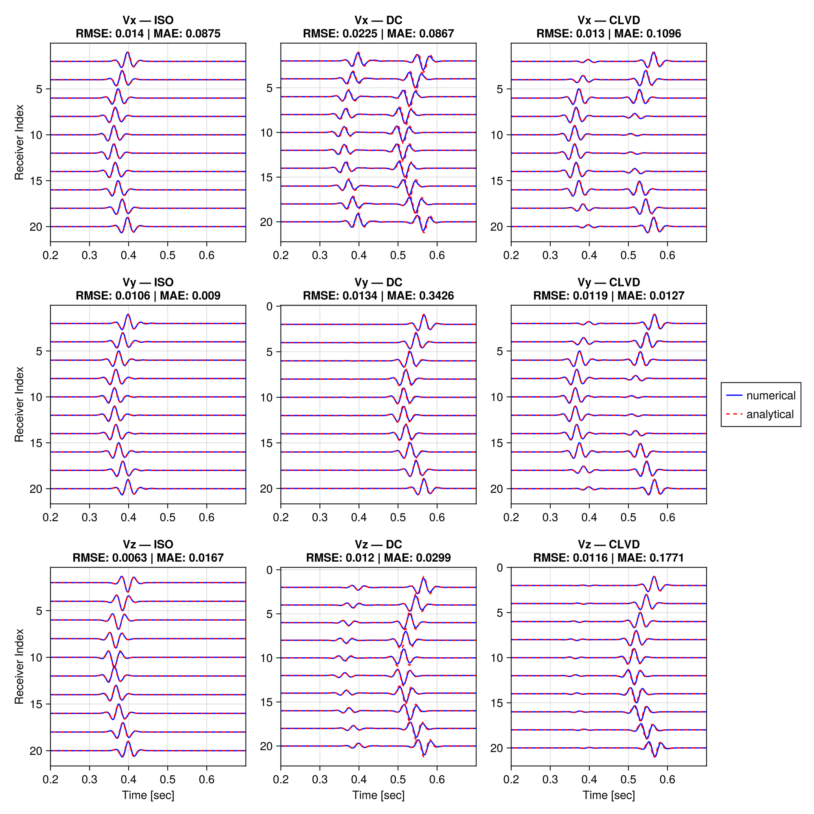

## Theory
This section provides a brief overview of the theoretical basis of the application.
For more comprehensive descriptions, readers are referred to literature listed below.

Elastic wave propagation in a 3D anisotropic linear elastic material can be described by the following set of first order partial differential equations:

```math
\begin{aligned}
\partial_{t} \sigma_{xx} &=  c_{11} \partial_{x} v_{x} + c_{12} \partial_{y} v_{y} + c_{13} \partial_{z} v_{z}  \\ 
\partial_{t} \sigma_{yy} &=  c_{12} \partial_{x} v_{x} + c_{22} \partial_{y} v_{y} + c_{23} \partial_{z} v_{z}  \\
\partial_{t} \sigma_{zz} &=  c_{13} \partial_{x} v_{x} + c_{23} \partial_{y} v_{y} + c_{33} \partial_{z} v_{z}  \\
\partial_{t} \sigma_{xy} &=  c_{66} (\partial_{x} v_{y} + \partial_{y} v_{x})  \\
\partial_{t} \sigma_{xz} &=  c_{55} (\partial_{x} v_{z} + \partial_{z} v_{x})  \\
\partial_{t} \sigma_{yz} &=  c_{44} (\partial_{y} v_{z} + \partial_{z} v_{y}) \tag{1} \\

\end{aligned}
```

```math
\begin{aligned}
\rho \partial_{t} v_{x} &= \partial_{x} \sigma_{xx} + \partial_{y} \sigma_{xy} + \partial_{z} \sigma_{xz}  \\
\rho \partial_{t} v_{y} &= \partial_{x} \sigma_{xy} + \partial_{y} \sigma_{yy} + \partial_{z} \sigma_{yz}  \\
\rho \partial_{t} v_{z} &= \partial_{x} \sigma_{xz} + \partial_{y} \sigma_{xz} + \partial_{z} \sigma_{zz}  \tag{2} \\
\end{aligned}
```

In these equations:
- are $\sigma_{xx}, \sigma_{yy}, \sigma_{zz}$ the normal stress components.
- are $\sigma_{xy}, \sigma_{xz}, \sigma_{yz}$ the shear stress components.
- are $c_{11}, c_{12}, c_{13}, c_{22}, c_{23}, c_{33}, c_{44}, c_{55}, c_{66}$ the 9 elastic constants needed to describe an orthorhombic material.
- is $\rho$ is the density of the material.
- are $v_{x}, v_{y}, v_{z}$ the particle velocities in the $x$, $y$, and $z$ directions, respectively.

Using the Tsvankin notation, isotropic, vertical transversal isotropic (VTI) and ortorhombic materials (ORT) can be characterized by two vertical velocities and 7 dimensionless paramters $\epsilon_{1}, \epsilon_{2}, \gamma_{1}, \gamma_{2}, \delta_{1}, \delta_{2}, \delta_{3}$ :

```math
\begin{aligned}
c_{33} &= v_{p0}^2 \cdot \rho \\
c_{55} &= v_{s0}^2 \cdot \rho \\
c_{11} &= (2 \epsilon_{2} + 1) \cdot c_{33} \\
c_{22} &= c_{33} \cdot (2 \epsilon_{1} + 1) \\
c_{66} &= c_{55} \cdot (2 \gamma_{1} + 1) \\
c_{44} &= \frac{c_{66}}{1 + \gamma_{2}} \\
c_{13} &= \sqrt{2 c_{33} \cdot (c_{33} - c_{55}) \cdot \delta_{2} + (c_{33} - c_{55})^2} - c_{55} \\
c_{23} &= \sqrt{2 c_{33} \cdot (c_{33} - c_{44}) \cdot \delta_{1} + (c_{33} - c_{44})^2} - c_{44} \\
c_{12} &= \sqrt{2 c_{11} \cdot (c_{11} - c_{66}) \cdot \delta_{3} + (c_{11} - c_{66})^2} - c_{66}
\end{aligned}
```


## Numerical Scheme 

The set of equations (1) and (2) can be solved using a finite-difference staggered-grid scheme. In a staggered grid, field quantities are not co-located on same grid points but are distributed across predefined grid cells. The primary advantage of a staggered grid is an enhanced accuracy of spatial central difference operators, as well as staggered temporal finite difference operators, which also improves the accuracy of the time marching.

However, the distribution of field quantities within a grid cell also has drawbacks, especially during the processing of the results. For example, users working with geophone data must consider that the velocity components $v_{x}, v_{y}, v_{z}$ are not measured at the same location.

The staggered grid scheme used in the application is illustrated below:


          ↑ y                           │      y              △             ■ vₓ  i,j,k
            │         i+½,j+½           │  z↑ /              /              ◆ vᵧ  i+½,j+½,k
      i,j+½ │         │vᵧ               │   │/              /               ● v𝑧  i+½,j,k+½ 
       σₓᵧ ─◇─────────◆───              │   ○ ............ ●
            │         │                 │   ╎              ╎                □ σₓₓ,σᵧᵧ,σ𝑧𝑧 i+½,j,k
            │         │                 │   ╎              ╎                ○ σₓ𝑧 i,j,k+½
            │         │                 │   ╎   ◇          ╎  ◆             ◇ σₓᵧ i,j+½,k
            ■─────────□──── ──→ x       │   ╎  /           ╎ /              △ σᵧ𝑧 i+½,j+½,k+½
            vₓ      σₓₓ,σᵧᵧ             │   ╎ /            ╎/  
           i,j       i+½,j              │   ■ ............ □ ─→ x 
                                        │ 

Using this scheme, the discrete form of (1) and (2) are given by:

```math
\begin{aligned}

\sigma_{xx \; (i+\frac{1}{2},j,k)}^{t_{n}+\frac{1}{2}} &= \sigma_{xx \; (i+\frac{1}{2},j,k)}^{t_{n}-\frac{1}{2}} \Delta t (c_{11} \mathcal{D}_{x} v_{x} + c_{12} \mathcal{D}_{y} v_{y} + c_{13} \mathcal{D}_{z} v_{z} ) \bigg|_{(i+\frac{1}{2},j,k)}^{t_{n}} \\ 

\sigma_{yy \; (i+\frac{1}{2},j,k)}^{t_{n}+\frac{1}{2}} &= \sigma_{yy \; (i+\frac{1}{2},j,k)}^{t_{n}-\frac{1}{2}} \Delta t (c_{12} \mathcal{D}_{x} v_{x} + c_{22} \mathcal{D}_{y} v_{y} + c_{23} \mathcal{D}_{z} v_{z} ) \bigg|_{(i+\frac{1}{2},j,k)}^{t_{n}} \\ 

\sigma_{zz \; (i+\frac{1}{2},j,k)}^{t_{n}+\frac{1}{2}} &= \sigma_{zz \; (i+\frac{1}{2},j,k)}^{t_{n}-\frac{1}{2}} \Delta t (c_{13} \mathcal{D}_{x} v_{x} + c_{23} \mathcal{D}_{y} v_{y} + c_{33} \mathcal{D}_{z} v_{z} ) \bigg|_{(i+\frac{1}{2},j,k)}^{t_{n}} \\ 

\sigma_{xy \; (i,j+\frac{1}{2},k)}^{t_{n}+\frac{1}{2}} &= \sigma_{xy \; (i,j+\frac{1}{2},k)}^{t_{n}-\frac{1}{2}} \Delta t \, c_{66} ( \mathcal{D}_{x} v_{y} +  \mathcal{D}_{y} v_{x})\bigg|_{(i,j+\frac{1}{2},k)}^{t_{n}} \\

\sigma_{xz \; (i,j,k+\frac{1}{2})}^{t_{n}+\frac{1}{2}} &= \sigma_{xz \; (i,j,k+\frac{1}{2})}^{t_{n}-\frac{1}{2}} \Delta t \, c_{55} ( \mathcal{D}_{x} v_{z} + \mathcal{D}_{z} v_{x})\bigg|_{(i,j,k+\frac{1}{2})}^{t_{n}} \\

\sigma_{yz \; (i+\frac{1}{2},j+\frac{1}{2},k+\frac{1}{2})}^{t_{n}+\frac{1}{2}} &= \sigma_{yz \; (i+\frac{1}{2},j+\frac{1}{2},k+\frac{1}{2})}^{t_{n}-\frac{1}{2}} \Delta t \, c_{44} ( \mathcal{D}_{y} v_{z} +  \mathcal{D}_{y} v_{z})\bigg|_{(i+\frac{1}{2},j+\frac{1}{2},k+\frac{1}{2})}^{t_{n}} \\
            
            
\end{aligned}
```      

```math
\begin{aligned}
v_{x \; (i,j,k)}^{t_{n}+1} &= v_{x \; (i,j,k)}^{t_{n}} \frac{\Delta t}{\rho} (\mathcal{D}_{x} \sigma_{xx} + \mathcal{D}_{y} \sigma_{xy} + \mathcal{D}_{z} \sigma_{xz}) \bigg|_{(i,j,k)}^{t_{n}+\frac{1}{2}} \\
v_{y \; (i+\frac{1}{2},j+\frac{1}{2},k)}^{t_{n}+1} &= v_{y \; (i+\frac{1}{2},j+\frac{1}{2},k)}^{t_{n}} \frac{\Delta t}{\rho} (\mathcal{D}_{x} \sigma_{xy} + \mathcal{D}_{y} \sigma_{yy} + \mathcal{D}_{z} \sigma_{yz}) \bigg|_{(i+\frac{1}{2},j+\frac{1}{2},k)}^{t_{n}+\frac{1}{2}} \\
v_{z \; (i+\frac{1}{2},j,k+\frac{1}{2})}^{t_{n}+1} &= v_{z \; (i+\frac{1}{2},j,k+\frac{1}{2})}^{t_{n}} \frac{\Delta t}{\rho} (\mathcal{D}_{x} \sigma_{xz} + \mathcal{D}_{y} \sigma_{xz} + \mathcal{D}_{z} \sigma_{zz}) \bigg|_{(i+\frac{1}{2},j,k+\frac{1}{2})}^{t_{n}+\frac{1}{2}} \tag{3}

\end{aligned}
```
Here $(i,j,k)$ represent the grid points in the x,y,z-directions, respectively; 
$t_{n}$ denotes the $n$-th time step; 
and $\Delta t$ the time increment.

The differential operators $\mathcal{D}$ are given by central difference approximations:

```math
\begin{aligned}

\mathcal{D_{x}} f = \sum_{n=1}^{N} \frac{c_{n}}{\Delta x} ( f(x_{i+n}, y_{j}, z_{k}) - f(x_{i- n}, y_{j}, z_{k})) \\
\mathcal{D_{y}} f = \sum_{n=1}^{N} \frac{c_{n}}{\Delta y} ( f(x_{i}, y_{j+n}, z_{k}) - f(x_{i}, y_{j-n}, z_{k})) \\
\mathcal{D_{z}} f = \sum_{n=1}^{N} \frac{c_{n}}{\Delta z} ( f(x_{i}, y_{j}, z_{k+n}) - f(x_{i}, y_{j}, z_{k-n}))
        
\end{aligned}
```      
with order $N$ and coefficients $c_{n}$.


To compute a spatial derivative of order $N$ at a specific location, at least $N$ neighboring nodes are required on both sides. As a result, for edge nodes no spatial derivatives can be calculated. These edge nodes (ghost nodes) are effective model boundaries and should lie outside the physical (user-defined) domain. The application automatically extends the user-defined domain with $N$ ghost node layers.


In staggered grids, it is often beneficial to assign certain elastic properties to specific points within the grid cell. However, requiring users to define such grids can become difficult to manage, particularly for complex media. To simplify this, we define all elastic properties at full integer grid points (e.g., on $v_{x}$) and effective properties are calculated by interpolating values from neighboring nodes.


## Sources 

Earthquake simulations require the excitation of external double-couple sources.
Source terms can be introduced in two different ways:
  - As body-force terms acting on the velocity field (e.g., Virieux, 1984). 
  - As incremental stresses acting on the stress field (e.g., Shi et al., 2018).

In the SG scheme shown above, using incremental stresses requires fewer terms and results in fewer numerical ambiguities compared to body forces, due to the distribution of velocity nodes around a source node.

A moment tensor source can be described by:

```math
\begin{aligned}
\mathbf{F}(t) = m_0 \, \boldsymbol{M} \, \text{STF}(t),
\end{aligned}
```  

where $m_0$ is the seismic moment, $\text{STF}(t)$ is the source time function, and $\boldsymbol{M}$ is the moment tensor with components:

```
M = [ Mxx  Mxy  Mxz
      Mxy  Myy  Myz
      Mxz  Myz  Mzz ]
```

Assuming a moment-tensor source acting on the stress field, the nearest normal stress node (i+1/2,j,k) serves as the central point.
To obtain a symmetrical solution, the shear stress components are then distributed symmetrically around this central node.
Thus, in total three normal and twelve shear stress components are required for the full staggered grid formulation:

```math
\begin{aligned}

V &= \Delta x \Delta y \Delta z \\ \\

s_{xx\; (i+\frac{1}{2},j,k)} &\mathrel{-}= \frac{\Delta t}{V} M_{xx} \, \frac{\partial \text{STF}}{\partial t} \\
s_{yy\; (i+\frac{1}{2},j,k)} &\mathrel{-}= \frac{\Delta t}{V} M_{yy} \, \frac{\partial \text{STF}}{\partial t} \\
s_{zz\; (i+\frac{1}{2},j,k)} &\mathrel{-}= \frac{\Delta t}{V} M_{zz} \, \frac{\partial \text{STF}}{\partial t} \\[0.5em]

s_{xy\; (,j+\frac{1}{2},k)} &\mathrel{-}= \frac{\Delta t}{4 V} M_{xy} \, \frac{\partial \text{STF}}{\partial t} \\
s_{xy\; (i+1,j+\frac{1}{2},k)} &\mathrel{-}= \frac{\Delta t}{4 V} M_{xy} \, \frac{\partial \text{STF}}{\partial t} \\
s_{xy\; (i,j-\frac{1}{2},k)} &\mathrel{-}= \frac{\Delta t}{4 V} M_{xy} \, \frac{\partial \text{STF}}{\partial t} \\
s_{xy\; (i+1,j-\frac{1}{2},k)} &\mathrel{-}= \frac{\Delta t}{4 V} M_{xy} \, \frac{\partial \text{STF}}{\partial t} \\[0.5em]

s_{xz\; (i,j,k+\frac{1}{2})} &\mathrel{-}= \frac{\Delta t}{4 V} M_{xz} \, \frac{\partial \text{STF}}{\partial t} \\
s_{xz\; (i+1,j,k+\frac{1}{2})} &\mathrel{-}= \frac{\Delta t}{4 V} M_{xz} \, \frac{\partial \text{STF}}{\partial t} \\
s_{xz\; (i,j,k-\frac{1}{2})} &\mathrel{-}= \frac{\Delta t}{4 V} M_{xz} \, \frac{\partial \text{STF}}{\partial t} \\
s_{xz\; (i,j,k-\frac{1}{2})} &\mathrel{-}= \frac{\Delta t}{4 V} M_{xz} \, \frac{\partial \text{STF}}{\partial t} \\[0.5em]

s_{yz\; (i+\frac{1}{2},j+\frac{1}{2},k+\frac{1}{2})} &\mathrel{-}= \frac{\Delta t}{4 V} M_{yz} \, \frac{\partial \text{STF}}{\partial t} \\
s_{yz\; (i+\frac{1}{2},j+\frac{1}{2},k-\frac{1}{2})} &\mathrel{-}= \frac{\Delta t}{4 V} M_{yz} \, \frac{\partial \text{STF}}{\partial t} \\
s_{yz\; (i+\frac{1}{2},j-\frac{1}{2},k+\frac{1}{2})} &\mathrel{-}= \frac{\Delta t}{4 V} M_{yz} \, \frac{\partial \text{STF}}{\partial t} \\
s_{yz\; (i+\frac{1}{2},j-\frac{1}{2},k-\frac{1}{2})} &\mathrel{-}= \frac{\Delta t}{4 V} M_{yz} \, \frac{\partial \text{STF}}{\partial t},
\end{aligned}
```  

where the notation $x \mathrel{-}= 1$ <-> $x := x - 1$ is used.

Users who want to model double couple earthquake sources can compute the moment tensor components for the following coordinate system using dip, strike, and rake values:
  
         x                  
       /                     
      /                        δ = Dip, λ = Rake, Φ = Strike                
      ---- y                   Coordinate System: x -> north,            
     |                                            y -> east,
     |                                            z -> positive downward
     z  

```math
\begin{aligned}
M_{xx} &= -(sin(\delta) \, cos(\lambda) \, sin(2\Phi) + sin(2\delta) \, sin(\lambda) \, sin(\Phi)^{2}) \\
M_{xy} &= \sin(\delta) \, \cos(\lambda) \, \cos(2\Phi) + \frac{1}{2} \sin(2\delta) \, \sin(\lambda) \, \sin(2\Phi) \\
M_{xz} &= -(\cos(\delta) \, \cos(\lambda) \, \cos(\Phi) + \cos(2\delta) \, \sin(\lambda) \, \sin(\Phi)) \\
M_{yy} &= \sin(\delta) \, \cos(\lambda) \, \sin(2\Phi) - \sin(2\delta) \, \sin(\lambda) \, \cos(\Phi)^2 \\
M_{yz} &= -(\cos(\delta) \, \cos(\lambda) \, \sin(\Phi) - \cos(2\delta) \, \sin(\lambda) \, \cos(\Phi)) \\
M_{zz} &= \sin(2\delta) \, \sin(\lambda)
\end{aligned}
```  

    
## C-PML 

Earthquake simulations often require modeling wave propagation in unbounded media. Perfectly Matched Layers (PML) is a very effective method to prevent artificial reflections at model boundaries.
The underlying idea is to manipulate the wave equation to obtain exponentially decaying plane wave solutions for complex arguments.
Assuming that the computational domain (real arguments) is surrounded by a complex region (the PML region), the amplitudes of incident waves decay and cause negligible reflections at the computational boundaries.


Komatitsch & Martin (2007) introduced a memory efficient convolution-based unsplit PML formulation (C-PML). 
This approach requires storing only one additional memory variable for each spatial derivative, but in the PML region only.
For the PML region, spatial derivative operators are replaced by:

```math
\begin{aligned}
\mathcal{D}_{\hat{x}} &= \frac{\mathcal{D_{x}}}{\kappa_{x}} + \Psi_{x} \tag{4}
\end{aligned}
```
Here, $\Psi_{x}$ represents the memory variable associated with the field from which the derivative is taken. The memory variable $\Psi_{x}$ is updated at each time step by:

```math
\begin{aligned}
\Psi_{x}^{t_{n}} &= b_{x} \Psi_{x}^{t_{n}-1} + a_{x} (\mathcal{D_{x}})^{t_{n} + \frac{1}{2}} \tag{5}
\end{aligned}
```

while $a_{x}$, $b_{x}$ $\kappa_{x}$ are precomputed PML related parameter. 
Accordingly, differential operators $\mathcal{D_{y}}$ and $\mathcal{D_{z}}$ are replaced by $\mathcal{D}_{\hat{y}}$ and $\mathcal{D}_{\hat{z}}$ in the PML-region. 


## Validation

To validate the implementation, numerically derived seismograms are compared with analytical solutions for a homogeneous medium for three different moment tensor sources:  
- isotropic (explosive, ISO),  
- double couple (DC), and  
- compensated linear vector dipole (CLVD),  
given by:

```math
M_{\text{ISO}} =
\begin{bmatrix}
1 & 0 & 0 \\
0 & 1 & 0 \\
0 & 0 & 1
\end{bmatrix},
\quad
M_{\text{DC}} =
\begin{bmatrix}
0 & 1 & 0 \\
1 & 0 & 0 \\
0 & 0 & 0
\end{bmatrix},
\quad
M_{\text{CLVD}} =
\begin{bmatrix}
1 & 0 & 0 \\
0 & 1 & 0 \\
0 & 0 & -2
\end{bmatrix}.
```

Analytical solutions can be obtained by convolving the moment tensors with the Green’s function.
For a Cartesian coordinate system that origins at a source location $\xi_{x,y,z}$, and a receiver located at $x_{x,y,z}$, we define:

```math
\begin{aligned}
r_{x,y,z} &= |\xi_{x,y,z} - x_{x,y,z}|, \\
\gamma_{x,y,z} &= (\xi_{x,y,z} - x_{x,y,z})/r_{x,y,z}.
\end{aligned}
```

The analytical displacement is then given by:

```math
\begin{aligned}
u_n &= M_{pq} * G_{np,q} \\[1ex]
    &= R_{ne} \, \frac{M_0}{4 \pi \rho r^4} 
       \int_{r/v_s}^{r/v_p} \tau \, S(t - \tau) \, d\tau \\[1ex]
    &\quad + R_{ip}^n \, \frac{1}{4 \pi \rho v_p^2 r^2} \, S(t - r/v_p) \\[1ex]
    &\quad + R_{is}^n \, \frac{1}{4 \pi \rho v_s^2 r^2} \, S(t - r/v_s) \\[1ex]
    &\quad + R_{fp}^n \, \frac{1}{4 \pi \rho v_p^3 r} \, \dot{S}(t - r/v_p) \\[1ex]
    &\quad + R_{fs}^n \, \frac{1}{4 \pi \rho v_s^3 r} \, \dot{S}(t - r/v_s)
\end{aligned}
```

with the near field term $R_{ne}$ give by:

```math
\begin{aligned}
R_{ne} =
\left( 15 \gamma_n \gamma_p \gamma_q
     - 3 \gamma_n \delta_{pq}
     - 3 \gamma_p \delta_{nq}
     - 3 \gamma_q \delta_{np} \right) M_{pq},
\end{aligned}
```

the p-wave intermediate field term $R_{ip}$ give by: 

```math
\begin{aligned}
R_{ip} =
\left( 6 \gamma_n \gamma_p \gamma_q
     - \gamma_n \delta_{pq}
     - \gamma_p \delta_{nq}
     - \gamma_q \delta_{np} \right) M_{pq},
\end{aligned}
```

the s-wave intermediate field term $R_{is}$ give by: 

```math
\begin{aligned}
R_{is} =
-\left( 6 \gamma_n \gamma_p \gamma_q
      - \gamma_n \delta_{pq}
      - \gamma_p \delta_{nq}
      - 2 \gamma_q \delta_{np} \right) M_{pq},

\end{aligned}
```

the p-wave far field term $R_{fp}$ give by: 

```math
\begin{aligned}
R_{fp} = \left( \gamma_n \gamma_p \gamma_q \right) M_{pq},
\end{aligned}
```

and the s-wave far field term $R_{fs}$ give by: 

```math
\begin{aligned}
R_{fs} = -\left( \gamma_n \gamma_p \gamma_q - \delta_{np} \gamma_q \right) M_{pq}
\end{aligned}
```

The following figure compares numerically forward-modeled seismograms with analytical solutions for all three moment tensors.
Analyitical velocities are obtained by differentiating the displacement.



As shown, all errors remain within a reasonable range and confirm implementation of elastic wave propagation and moment tensor sources.

## References 

Komatitsch, D., & Martin, R. (2007). An unsplit convolutional perfectly matched layer improved at grazing incidence for the seismic wave equation. Geophysics, 72(5), SM155-SM167.

Moczo, P., Kristek, J., & Gális, M. (2014). The finite-difference modelling of earthquake motions: Waves and ruptures. Cambridge University Press.

Shi, P., Angus, D., Nowacki, A., Yuan, S., & Wang, Y. (2018). Microseismic full waveform modeling in anisotropic media with moment tensor implementation. Surveys in Geophysics, 39(4), 567-611.

Tsvankin, I. (1997). Anisotropic parameters and P-wave velocity for orthorhombic media. Geophysics, 62(4), 1292-1309.

Virieux, J. (1984). SH-wave propagation in heterogeneous media: Velocity-stress finite-difference method. Geophysics, 49(11), 1933-1942. 

