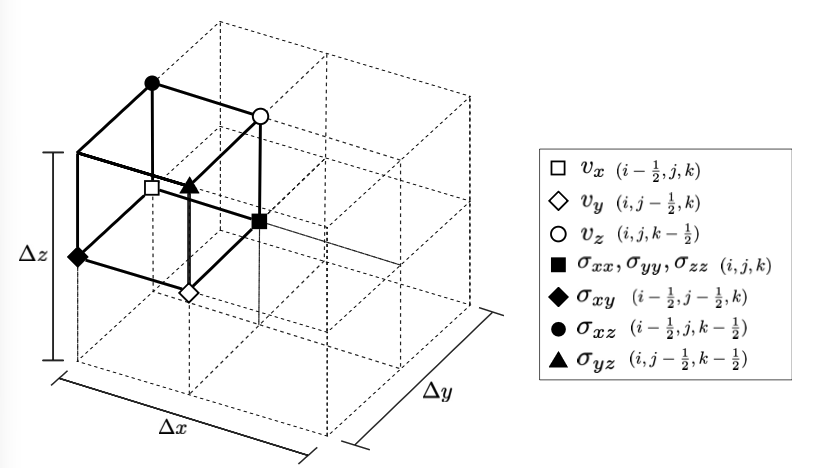

# Method

This section gives an overview of the numerical method implemented in ElasticFDSG.
For a comprehensive treatment of related subjects readers are referred to
Virieux (1986), Levander (1988), and Komatitsch & Martin (2007).

---

## Governing equations

Elastic wave propagation in a linear anisotropic medium is governed by the first-order
velocity–stress system:

```math
\begin{aligned}
\rho \, \partial_t v_x &= \partial_x \sigma_{xx} + \partial_y \sigma_{xy} + \partial_z \sigma_{xz} \\
\rho \, \partial_t v_y &= \partial_x \sigma_{xy} + \partial_y \sigma_{yy} + \partial_z \sigma_{yz} \\
\rho \, \partial_t v_z &= \partial_x \sigma_{xz} + \partial_y \sigma_{yz} + \partial_z \sigma_{zz}
\end{aligned}
```

```math
\begin{aligned}
\partial_t \sigma_{xx} &= C_{11}\,\partial_x v_x + C_{12}\,\partial_y v_y + C_{13}\,\partial_z v_z \\
\partial_t \sigma_{yy} &= C_{12}\,\partial_x v_x + C_{22}\,\partial_y v_y + C_{23}\,\partial_z v_z \\
\partial_t \sigma_{zz} &= C_{13}\,\partial_x v_x + C_{23}\,\partial_y v_y + C_{33}\,\partial_z v_z \\
\partial_t \sigma_{xy} &= C_{66}\!\left(\partial_x v_y + \partial_y v_x\right) \\
\partial_t \sigma_{xz} &= C_{55}\!\left(\partial_x v_z + \partial_z v_x\right) \\
\partial_t \sigma_{yz} &= C_{44}\!\left(\partial_y v_z + \partial_z v_y\right)
\end{aligned}
```

The nine independent stiffness coefficients $C_{11}, C_{12}, C_{13}, C_{22}, C_{23}, C_{33}, C_{44}, C_{55}, C_{66}$
describe the most general symmetry supported: **orthorhombic (ORT)**.

### Stiffness from Tsvankin parameters

For 3D models, the stiffness tensor is assembled from the Tsvankin parameterisation:

```math
\begin{aligned}
C_{33} &= V_{P0}^2 \, \rho \\
C_{55} &= V_{S0}^2 \, \rho \\
C_{11} &= (2\varepsilon_2 + 1)\,C_{33} \\
C_{22} &= (2\varepsilon_1 + 1)\,C_{33} \\
C_{66} &= (2\gamma_1   + 1)\,C_{55} \\
C_{44} &= C_{66} / (1 + \gamma_2) \\
C_{13} &= \sqrt{2C_{33}(C_{33}-C_{55})\,\delta_2 + (C_{33}-C_{55})^2} - C_{55} \\
C_{23} &= \sqrt{2C_{33}(C_{33}-C_{44})\,\delta_1 + (C_{33}-C_{44})^2} - C_{44} \\
C_{12} &= \sqrt{2C_{11}(C_{11}-C_{66})\,\delta_3 + (C_{11}-C_{66})^2} - C_{66}
\end{aligned}
```
VTI and isotropic models are special cases that can be constructed by the appropiate choice of Tsvankin parameter (see [User Guide](userguide/velmod.md)).
For 2D models the standard Thomsen parameterisation is used instead ($\epsilon$, $\delta$).

---

## Staggered-grid discretisation

Field components are not co-located but distributed across the unit cell following the
standard staggered-grid layout of Virieux (1986).
The diagram below shows the elementary cell with all 9 field components placed at their staggered positions:



The discrete **leapfrog** scheme advances velocities and stresses alternately at half-integer time steps.

**Velocity updates** (evaluated at staggered positions, using stresses at time $n$):

```math
\begin{aligned}
v_{x}^{n+\frac{1}{2}}\big|_{(i-\frac{1}{2},\,j,\,k)}
  &= v_{x}^{n-\frac{1}{2}}\big|_{(i-\frac{1}{2},\,j,\,k)}
   + \frac{\Delta t}{\rho_{(i-\frac{1}{2},j,k)}}
     \Big(\partial_x\sigma_{xx} + \partial_y\sigma_{xy} + \partial_z\sigma_{xz}\Big)\Big|_{(i-\frac{1}{2},\,j,\,k)}^{n}
\\[6pt]
v_{y}^{n+\frac{1}{2}}\big|_{(i,\,j-\frac{1}{2},\,k)}
  &= v_{y}^{n-\frac{1}{2}}\big|_{(i,\,j-\frac{1}{2},\,k)}
   + \frac{\Delta t}{\rho_{(i,j-\frac{1}{2},k)}}
     \Big(\partial_x\sigma_{xy} + \partial_y\sigma_{yy} + \partial_z\sigma_{yz}\Big)\Big|_{(i,\,j-\frac{1}{2},\,k)}^{n}
\\[6pt]
v_{z}^{n+\frac{1}{2}}\big|_{(i,\,j,\,k-\frac{1}{2})}
  &= v_{z}^{n-\frac{1}{2}}\big|_{(i,\,j,\,k-\frac{1}{2})}
   + \frac{\Delta t}{\rho_{(i,j,k-\frac{1}{2})}}
     \Big(\partial_x\sigma_{xz} + \partial_y\sigma_{yz} + \partial_z\sigma_{zz}\Big)\Big|_{(i,\,j,\,k-\frac{1}{2})}^{n}
\end{aligned}
```

**Stress updates** (evaluated at staggered positions, using velocities at time $n+\frac{1}{2}$):

```math
\begin{aligned}
\sigma_{xx}^{n+1}\big|_{(i,j,k)}
  &= \sigma_{xx}^{n}\big|_{(i,j,k)}
   + \Delta t\Big(C_{11}\,\partial_x v_x + C_{12}\,\partial_y v_y + C_{13}\,\partial_z v_z\Big)\Big|_{(i,j,k)}^{n+\frac{1}{2}}
\\[4pt]
\sigma_{yy}^{n+1}\big|_{(i,j,k)}
  &= \sigma_{yy}^{n}\big|_{(i,j,k)}
   + \Delta t\Big(C_{12}\,\partial_x v_x + C_{22}\,\partial_y v_y + C_{23}\,\partial_z v_z\Big)\Big|_{(i,j,k)}^{n+\frac{1}{2}}
\\[4pt]
\sigma_{zz}^{n+1}\big|_{(i,j,k)}
  &= \sigma_{zz}^{n}\big|_{(i,j,k)}
   + \Delta t\Big(C_{13}\,\partial_x v_x + C_{23}\,\partial_y v_y + C_{33}\,\partial_z v_z\Big)\Big|_{(i,j,k)}^{n+\frac{1}{2}}
\\[4pt]
\sigma_{xy}^{n+1}\big|_{(i-\frac{1}{2},\,j-\frac{1}{2},\,k)}
  &= \sigma_{xy}^{n}\big|_{(i-\frac{1}{2},\,j-\frac{1}{2},\,k)}
   + \Delta t\,C_{66}\Big(\partial_x v_y + \partial_y v_x\Big)\Big|_{(i-\frac{1}{2},\,j-\frac{1}{2},\,k)}^{n+\frac{1}{2}}
\\[4pt]
\sigma_{xz}^{n+1}\big|_{(i-\frac{1}{2},\,j,\,k-\frac{1}{2})}
  &= \sigma_{xz}^{n}\big|_{(i-\frac{1}{2},\,j,\,k-\frac{1}{2})}
   + \Delta t\,C_{55}\Big(\partial_x v_z + \partial_z v_x\Big)\Big|_{(i-\frac{1}{2},\,j,\,k-\frac{1}{2})}^{n+\frac{1}{2}}
\\[4pt]
\sigma_{yz}^{n+1}\big|_{(i,\,j-\frac{1}{2},\,k-\frac{1}{2})}
  &= \sigma_{yz}^{n}\big|_{(i,\,j-\frac{1}{2},\,k-\frac{1}{2})}
   + \Delta t\,C_{44}\Big(\partial_y v_z + \partial_z v_y\Big)\Big|_{(i,\,j-\frac{1}{2},\,k-\frac{1}{2})}^{n+\frac{1}{2}}
\end{aligned}
```

The central difference operators for accuracy order $N$ with coefficients $k_l$ are:

```math
\begin{aligned}
\partial_x f\big|_{(i,j,k)} &\approx \sum_{l=1}^{N} \frac{k_l}{\Delta x}
  \Bigl(f_{(i+l,\,j,\,k)} - f_{(i-l,\,j,\,k)}\Bigr) \\[4pt]
\partial_y f\big|_{(i,j,k)} &\approx \sum_{l=1}^{N} \frac{k_l}{\Delta y}
  \Bigl(f_{(i,\,j+l,\,k)} - f_{(i,\,j-l,\,k)}\Bigr) \\[4pt]
\partial_z f\big|_{(i,j,k)} &\approx \sum_{l=1}^{N} \frac{k_l}{\Delta z}
  \Bigl(f_{(i,\,j,\,k+l)} - f_{(i,\,j,\,k-l)}\Bigr)
\end{aligned}
```

The combination of staggered spatial and temporal grids yields **second-order accuracy in both space and time**, $\mathcal{O}(\Delta t^2,\, \Delta x^{2N})$.

Note that since density $\rho$ and stiffness $C_{ij}$ are defined at integer nodes, effective values
at staggered positions are obtained by averaging neighboring grid points, introducing a non-physical smoothing of material discontinuities.

---

## Domain extension

Starting from the user-defined physical domain of size $n_x \times n_y \times n_z$, the grid is
extended in two stages:

1. **PML layers** — $N_\mathrm{PML}$ absorbing cells appended at each absorbing boundary.
2. **Ghost nodes** — $N_g = N$ additional cells beyond the PML to support the finite-difference
   stencil at every interior point.

Material properties in the extended region are filled by nearest-neighbour replication from
the physical domain.

---

## Absorbing boundaries — C-PML

Without absorbing boundaries, waves reflect off the computational domain edges.
ElasticFDSG uses the **convolutional perfectly matched layer (C-PML)** of
Komatitsch & Martin (2007), which replaces each spatial derivative $\partial_x$
with the modified operator:

```math
\tilde{\partial}_x f = \partial_x f + \psi_x
```

where $\psi_x$ is a memory variable updated each time step:

```math
\psi_x^{n+1} = b_x \, \psi_x^{n} + a_x \, \partial_x f^{n+1}
```

The precomputed coefficients are:

```math
b_x = \exp\!\bigl(-(d_x + \alpha_x)\Delta t\bigr), \qquad
a_x = \frac{d_x}{d_x + \alpha_x}(b_x - 1)
```

The damping profile $d_x$ increases polynomially from zero at the physical/PML interface
to a maximum at the outer boundary, while the frequency-shift parameter $\alpha_x$ is set to
$\pi f_\mathrm{dom}$.
This formulation requires **18 additional memory variables** in 3D (6 per spatial direction),
stored only inside the PML region.

!!! warning "PML stability for anisotropic media"
    The C-PML is intrinsically unstable for anisotropic materials whose quasi-shear slowness
    surface is non-convex (Bécache et al. 2003).
    This includes many shale formations with high anellipticity.
    In practice, sufficiently thick PML regions typically attenuate such modes before
    they re-enter the physical domain, but instabilities may still appear in extreme cases.

---

## Moment tensor source

Sources are injected as incremental stresses following Shi et al. (2018).
The source time function derivative $\dot{s}(t)$ is scaled by the scalar seismic moment $M_0$
and distributed over the stress components:

```math
\sigma_{xx(i,j,k)}^{n+1} \mathrel{-}= \frac{\Delta t}{\Delta x \Delta y \Delta z} M_0 \hat{M}_{xx} \dot{s}(t_{n+1})
```

The normal stress components are applied at a single node $(i,j,k)$.
Each shear component is symmetrically distributed over **four** neighboring nodes:

```math
\sigma_{xy(I)}^{n+1} \mathrel{-}=
\frac{\Delta t}{4 \Delta x \Delta y \Delta z} M_0 \hat{M}_{xy} \dot{s}(t_{n+1}),
\quad I = \!\left(i{\pm}\tfrac{1}{2},\, j{\pm}\tfrac{1}{2},\, k\right)
```

(and analogously for $\sigma_{xz}$ and $\sigma_{yz}$).
This symmetric distribution produces the correct radiation pattern for each moment tensor configuration.

### Moment tensor from fault geometry

For shear-slip (double-couple) sources, the moment tensor components can be computed
from strike $\Phi$, dip $\delta$, and rake $\lambda$ (coordinate system: $x$→ North, $y$→ East, $z$↓):

```math
\begin{aligned}
M_{xx} &= -\!\bigl(\sin\delta\cos\lambda\sin 2\Phi + \sin 2\delta\sin\lambda\sin^2\!\Phi\bigr) \\
M_{yy} &= \phantom{-}\sin\delta\cos\lambda\sin 2\Phi - \sin 2\delta\sin\lambda\cos^2\!\Phi \\
M_{zz} &= \phantom{-}\sin 2\delta\sin\lambda \\
M_{xy} &= \phantom{-}\sin\delta\cos\lambda\cos 2\Phi + \tfrac{1}{2}\sin 2\delta\sin\lambda\sin 2\Phi \\
M_{xz} &= -\!\bigl(\cos\delta\cos\lambda\cos\Phi + \cos 2\delta\sin\lambda\sin\Phi\bigr) \\
M_{yz} &= -\!\bigl(\cos\delta\cos\lambda\sin\Phi - \cos 2\delta\sin\lambda\cos\Phi\bigr)
\end{aligned}
```

---

## Receivers

### Geophones

Point receivers record the three particle velocity components $v_x$, $v_y$, $v_z$ at each time step.
Due to the staggered arrangement, each component is sampled at its natural staggered grid location
(offset by half a cell from the nominal receiver position).

### DAS

Distributed acoustic sensing (DAS) receivers record **axial strain** along coordinate-aligned profiles.
Within the staggered-grid framework, strain can be reconstructed from the co-located normal stress
components via the compliance relation:

```math
\begin{bmatrix} \varepsilon_{xx} \\ \varepsilon_{yy} \\ \varepsilon_{zz} \end{bmatrix}
= \begin{bmatrix} C_{11} & C_{12} & C_{13} \\ C_{12} & C_{22} & C_{23} \\ C_{13} & C_{23} & C_{33} \end{bmatrix}^{-1}
\begin{bmatrix} \sigma_{xx} \\ \sigma_{yy} \\ \sigma_{zz} \end{bmatrix}
```

The axial strain component along the fiber orientation is extracted from the resulting vector.
Gauge-length integration or conversion to strain rate can be performed in post-processing.
Only fibers aligned with the $x$-, $y$-, or $z$-axis are supported.

---

## References

- Virieux, J. (1986). P-SV wave propagation in heterogeneous media: Velocity-stress finite-difference method. *Geophysics*, 51(4), 889–901.
- Levander, A. R. (1988). Fourth-order finite-difference P-SV seismograms. *Geophysics*, 53(11), 1425–1436.
- Komatitsch, D., & Martin, R. (2007). An unsplit convolutional perfectly matched layer improved at grazing incidence for the seismic wave equation. *Geophysics*, 72(5), SM155–SM167.
- Shi, P., Angus, D., Nowacki, A., Yuan, S., & Wang, Y. (2018). Microseismic full waveform modeling in anisotropic media with moment tensor implementation. *Surveys in Geophysics*, 39, 567–611.
- Bécache, E., Fauqueux, S., & Joly, P. (2003). Stability of perfectly matched layers, group velocities and anisotropic waves. *Journal of Computational Physics*, 188(2), 399–433.