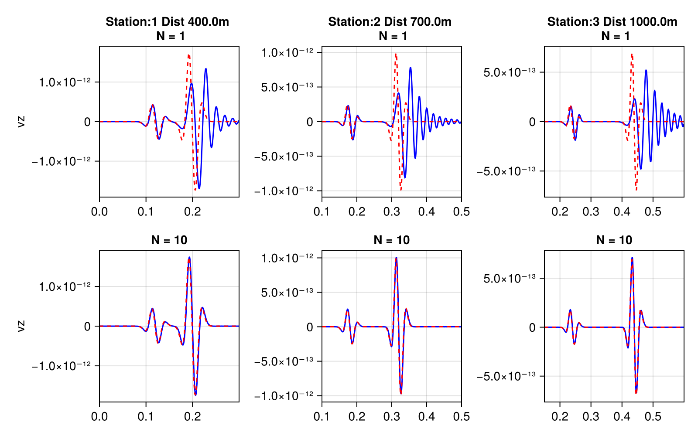
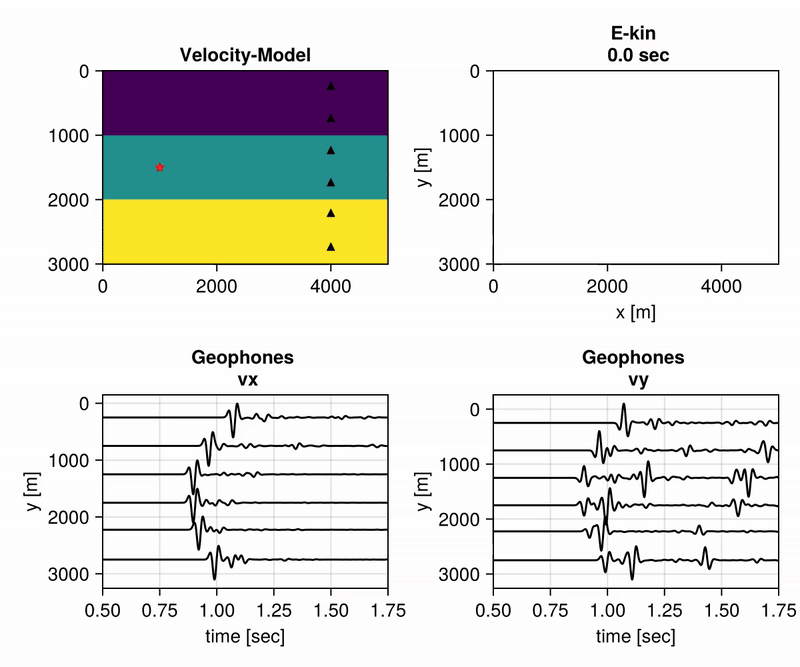

## Validation

To validate the outputs of the application, numerically derived seismometers are compared with analytical solutions for a given homogeneous medium.

Solutions for inhomogeneous partial differential equations can be obtained using Green's functions 
$G(\mathbf{x}, t; \mathbf{x_{0}}, t_{0})$ with $\delta$-functions as source terms acting on $(\mathbf{x}, t)$ and activated on $(\mathbf{x_{0}}, t_{0})$.

The solution to that problem leads to the practical relationship that the displacement field can be described by a convolution of the Green's function with the source-time function:

```math

u_{i} = G * S, \quad i \in \{x, y, z\}.

```

The velocity can then be derived as:

```math

v_{i} = \frac{\partial u_{i}}{\partial t}, \quad i \in \{x, y, z\}.

```

In the 2D case, the Green's function is given by:

```math
G_{2D}(\mathbf{x}, t; \mathbf{x_{0}}, t_{0}) = \frac{1}{2\pi \rho c^2} \frac{H\biggl((t-t_{0})-\frac{r}{c}\biggr)}{\sqrt{(t-t_{0})^2-\frac{r^2}{c^2}}},

```

and in the 3D case:


```math

G_{3D}(\mathbf{x}, t; \mathbf{x_{0}}, t_{0}) = \frac{1}{4 \pi \rho c^2 r} \delta(t - \frac{r}{c})


```

In the equations above, $\rho$ represents the density, $c$ is the wave speed, $H$ is the Heaviside function, $\delta$ is the Dirac delta function and $r$ the 2 and 3D Euclidian distance, respectivly.

The following images show a comparison of numerical seismograms with corresponding analytical solutions (red dashed lines). 


2D:


3D: 



The examples above were selected to illustrate grid-dispersion.
As indicated, grid-dispersion can be counteracted with higher order spatial derivative operators $N$. 
However, more important is to set the grid spacing sufficiently fine to avoid grid-dispersion.
The images show that the numerical solution is sufficiently close to the analytical one, but the quality of the solution depends on the simulation setup.

For heterogeneous media, analytical solutions are not so easily obtainable. 
Additionally, unique characteristics of various numerical methods make it challenging to compare results across different approaches.
For that reason, the "validation" of heterogeneous media is yet left completely on a visible basis:

